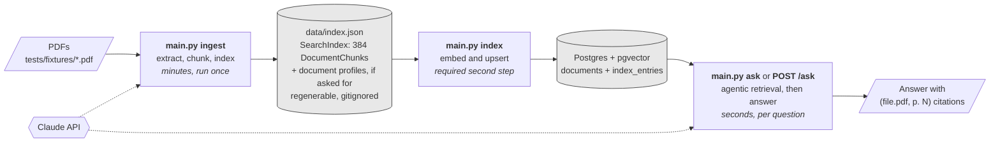
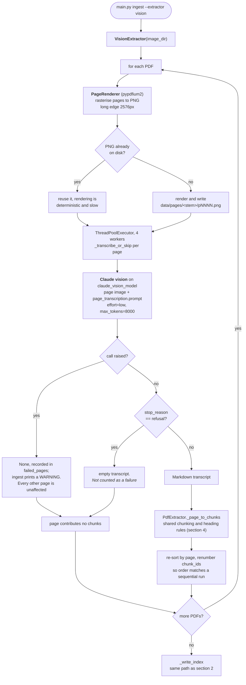
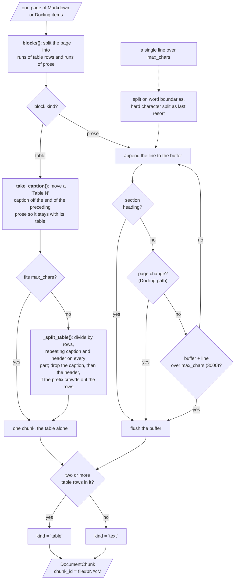
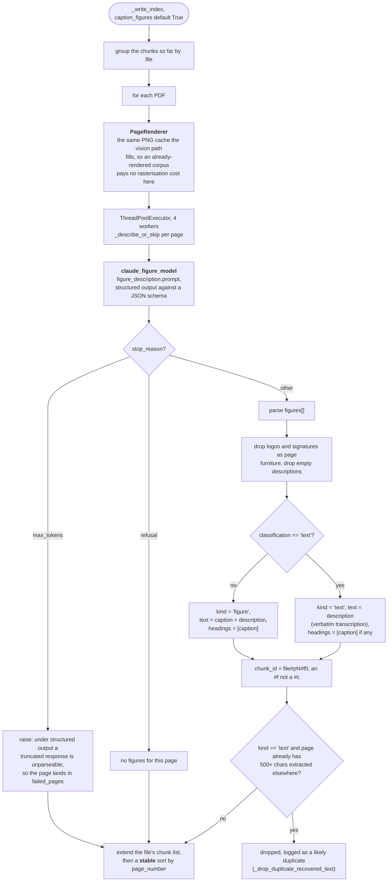
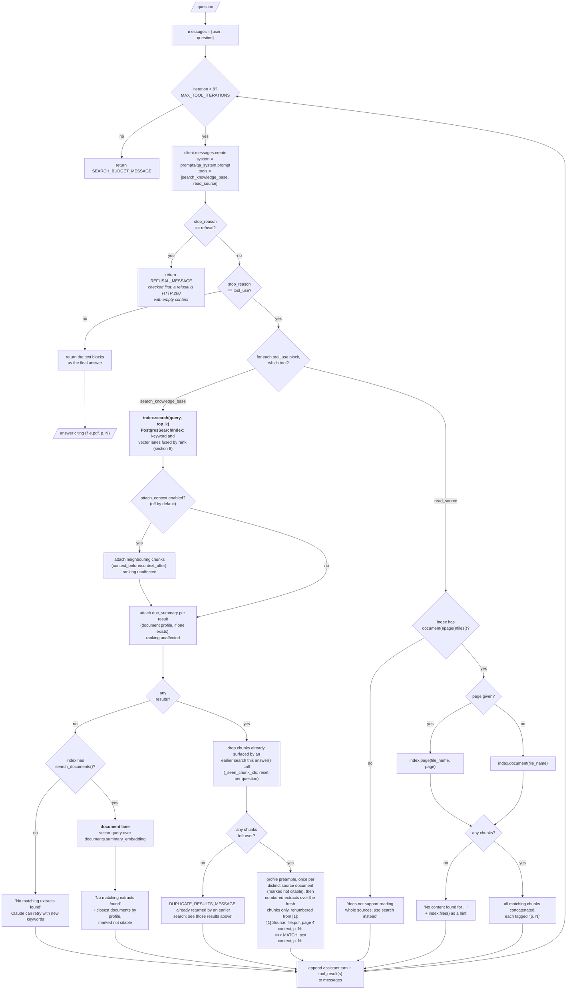
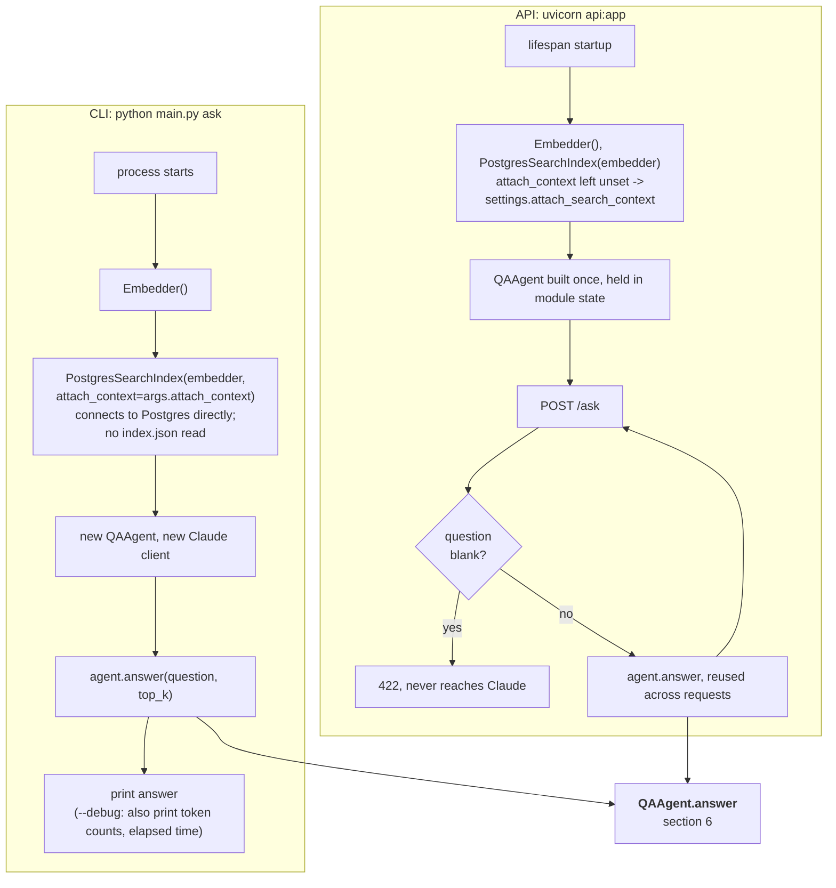
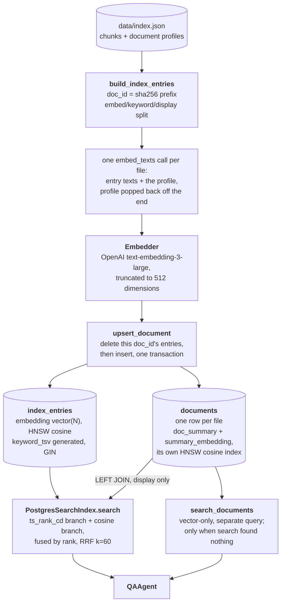
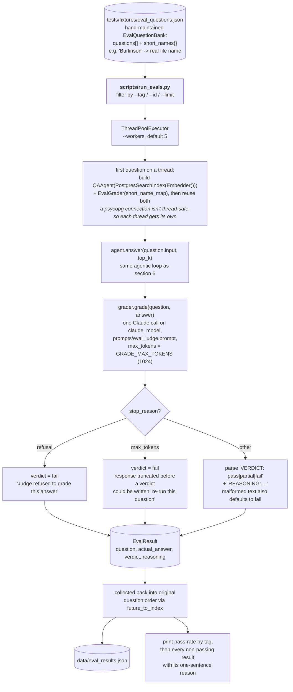

# Flow charts

How the system runs, end to end. Diagrams are Mermaid, so they render on any Markdown
viewer that supports it.

For what each component does see [features.md](features.md), for why it is built this
way see [architecture.md](architecture.md), for the retrieval mechanics in depth (query
rewriting, RRF, the schema) see [search.md](search.md), and for what is built versus
planned see [roadmap.md](roadmap.md).

## 1. The system at a glance

Three commands joined by stored state, none of which imports another. Extraction is slow
and one-off, offline apart from its opt-in Claude stages; dense indexing is a deliberate
second step because it needs Postgres and the embedding model; question answering is fast,
stateless and runs per question.

`PostgresSearchIndex` is the sole retriever, implementing
`search(query, top_k) -> list[SearchResult]` plus `document()`/`page()`/`files()`
(unlocking `read_source`) and `search_documents()` (the document-profile fallback). An
earlier JSON-backed `LexicalSearchIndex` (BM25 keyword search, selected with
`--backend bm25`/`--backend postgres`) existed and has been deleted -- `ask` and `api.py`
always go straight to Postgres now, so `main.py index` is no longer optional the way the
diagram above once showed it.

## 2. Ingestion, default "fast" extractor

`python main.py ingest` with `--extractor fast` (the default). The routing decision is
made **per page**, not per document, which is the whole point of the two-tier design.

```mermaid
flowchart TD
    Start(["main.py ingest --extractor fast"]) --> Glob["sorted(source.glob('*.pdf'))"]
    Glob --> Any{"any PDFs?"}
    Any -- no --> Fail1["print 'No PDFs found'<br>exit 1"]
    Any -- yes --> Loop["for each PDF"]

    Loop --> Fast["<b>PdfExtractor</b> (pdf_inspector, Rust)<br>extract_chunks + pages_needing_ocr"]
    Fast --> Err{"raised?"}
    Err -- yes --> Skip["print FAILED, skip this PDF"] --> Next
    Err -- no --> NeedsOCR{"pages_needing_ocr<br>non-empty?"}

    NeedsOCR -- no --> Collect["chunks from the fast path only"]
    NeedsOCR -- yes --> Lazy["build <b>DocumentExtractor</b> lazily<br>first time only, loads Docling +<br>OCR/layout/table models"]
    Lazy --> Slow["extract_chunks_for_pages(pdf, ocr_pages)<br>contiguous runs via Docling page_range"]
    Slow --> Merge["concatenate, then sort by page_number"]
    Merge --> Collect

    Collect --> Next["accumulate into chunks[]"]
    Next --> More{"more PDFs?"}
    More -- yes --> Loop
    More -- no --> Write["_write_index"]

    Write --> Empty{"chunks empty?"}
    Empty -- yes --> Fail2["print 'No content extracted'<br>exit 1"]
    Empty -- no --> Cap{"--no-caption-figures?"}
    Cap -- no, default --> Figs["<b>FigureCaptioner</b><br>one Claude call per candidate page<br>adds kind='figure' chunks, plus<br>kind='text' for recovered body text<br>(section 5)"]
    Cap -- yes --> Enh
    Figs --> Dedup["_drop_duplicate_recovered_text<br>drops a kind='text' chunk if its page<br>already has 500+ chars extracted"]
    Dedup --> Enh{"--enhance-metadata?"}
    Enh -- yes --> Summ["<b>MetadataEnhancer</b><br>one Claude call per table chunk<br>36 calls for the fixtures"]
    Enh -- no --> Prof
    Summ --> Prof{"--summarise-documents?"}
    Prof -- yes --> Docs["<b>DocumentSummarizer</b><br>one Claude call per file<br>8 calls for the fixtures"]
    Prof -- no --> Build
    Docs --> Build["<b>SearchIndex</b>(chunks=chunks, documents=documents)"]
    Build --> Save[("save to data/index.json<br>chunks and document profiles")]
    Save --> Done(["exit 0"])
```

Points worth knowing before changing this:

- The three optional stages run in that order on purpose. Captioning first means figure
  chunks get summarised too; profiling last means a profile describes the final chunk
  list rather than a list the other flags were about to change.
- Captioning is the one stage of the three that runs by default; the other two stay
  opt-in. See
  [architecture.md](architecture.md#why-figure-captioning-is-the-one-exception) for why.
- `DocumentExtractor` is constructed inside the loop, so a corpus with no scanned pages
  never loads Docling or torch at all.
- A per-document text-layer test instead of a per-page one silently drops the scanned
  front matter of `1-s2.0-S0140988325000672-main.pdf`. See
  [architecture.md](architecture.md#the-bug-this-design-exists-to-prevent).
- Docling's `page_range` preserves absolute page numbers, which is why the merge is a
  plain concatenate and sort with no offset arithmetic. Chunk IDs do collide across
  conversion calls, so `extract_chunks_for_pages` renumbers over the merged list.

## 3. Ingestion, "vision" extractor

`python main.py ingest --extractor vision` is an alternative first stage, not a fallback
the fast path picks up on its own. It reads a picture of the page rather than the PDF's
internal structure, so scanned and born-digital pages cost the same: one Claude call
each.

Both extraction paths converge on the same `_write_index`, and both emit the same
`DocumentChunk` shape, so nothing downstream can tell which produced the index.

A page that raised and a page that came back empty are deliberately distinguishable: only
the first lands in `failed_pages`, which `ingest` prints as a warning, because a silently
short document is worse than a loud failure. Transcription runs on
`claude_vision_model` rather than `claude_model`, since the job is bounded by how much of
the render the model can resolve rather than by reasoning.

## 4. Chunking, common to every extractor

Tables are lifted out of the page first and never share a chunk with the prose around
them. What is left accumulates into a buffer and flushes on the same triggers everywhere,
so a chunk never straddles a page and its citation stays unambiguous.

- `max_chars` is a hard bound, not a target, and the table path honours it too. Docling
  hands back a whole table however wide it is, so `DocumentExtractor` splits it with the
  same `_split_table` rule the fast path uses.
- Every part repeats the header rather than being cut on the character budget alone,
  because a part that is a run of numbers with no column names is worse than useless: the
  values cannot be attributed to a variable, or can be attributed to the wrong one.
- `kind` is counted from the chunk's own content, two or more pipe-prefixed rows, rather
  than tested on its first line: a real table is introduced by its caption, and often a
  running header before that, so a first-line test classifies whole tables as prose. The
  answer matters downstream, because `index_entry_builder` embeds a table's summary but
  keyword-searches its full Markdown.
- Figures never come from here. Both PDF extractors skip picture items, so figure chunks
  are produced by a separate stage, next.

## 5. Figure captioning, on by default (`--no-caption-figures` to skip)

A value that exists only as a label inside a chart or a map is unreachable by every other
path in this pipeline. This stage makes it searchable, and it works behind either
extractor because detection runs on the rendered page rather than on the PDF's structure.
It also recovers body text a layout model boxed as a misclassified picture -- see
[architecture.md](architecture.md#why-figure-captioning-is-the-one-exception) for the bug
that made this the one stage of the three that isn't opt-in.

The sort has to be stable and the figures have to be appended before it rather than
inserted: each page's figures then land after that page's text, with text order within a
page untouched. A recovered `kind="text"` chunk merges into search and citations like any
other extracted text; whether it gains a `context_before`/`context_after` neighbour window
depends on `PostgresSearchIndex`'s `attach_context` setting (section 6), off by default.

The caption is repeated into `headings` so its tokens get the weighting a section title
gets, which is what lets a query naming "Figure 5" rank the figure itself above prose that
merely mentions it. The `#f` discriminator keeps these IDs from colliding with the `#c`
text chunks numbered over the same pages. A page that failed and a page with genuinely no
figures are otherwise indistinguishable in the output, which is why only the first goes
into `failed_pages`.

## 6. Question answering, the agentic loop

`QAAgent` does not retrieve once and stuff the results into the prompt. Claude is given
two tools -- `search_knowledge_base` and `read_source` -- and writes the search keywords
itself, because a natural-language question searched verbatim scores badly under
Postgres full-text search.

Claude may call either tool more than once -- narrower keywords on
`search_knowledge_base`, or escalating to `read_source` when a result looks decisive but
incomplete (cut off mid-sentence, a table with no header, a footnote or figure it can't
see) -- before answering. The loop is capped so a model stuck rephrasing the same query,
or alternating between the two tools, cannot run forever.

`_seen_chunk_ids` tracks every chunk ID already sent to the model this `answer()` call and
is reset at the start of the next one, so it never leaks across questions. A rephrased
query that re-surfaces a chunk already in the conversation history sends it once, not
again per search: repeating it would waste context and read as new evidence when it is
the same evidence restated. If every chunk a search returns has already been seen,
Claude gets `DUPLICATE_RESULTS_MESSAGE` rather than an empty-looking result, pointing it
back at the earlier results instead of at `_no_results_message`'s "try different
keywords", since the query did match, just nothing new. Numbering in the formatted
extracts (`[1]`, `[2]`, ...) restarts from 1 over the surviving fresh chunks each call, so
it is only ever local to that tool result, never a running count across the conversation.

Document profiles never enter the ranked list. They are attached after scoring, printed
once per document, and reachable as a ranked thing only through the separate document
lane, which runs only when chunk search found nothing.

There is one backend, `PostgresSearchIndex`, and it implements `document()`, `page()` and
`files()` unconditionally, so `read_source` (the `Supported` branch above) always works.
Neighbouring-chunk context is the one piece that is *not* unconditional: it is gated
behind `attach_context`/`settings.attach_search_context`, off by default, because
fetching and sending it costs real tokens on every match whether or not that match needed
it (see [search.md](search.md#unconditional-per-match-and-off-by-default-because-of-it)
for the full tradeoff). `main.py ask --attach-context` or `ATTACH_SEARCH_CONTEXT=true` in
`.env` turns it on. The `hasattr` degrade-gracefully pattern described in
[architecture.md](architecture.md#the-retriever-protocol) is still how a future retriever
implementing only `search()` would lose the escalation path without erroring; it just
doesn't currently distinguish two backends here, only the one that exists.

## 7. Entry points and process lifetime

Same agent, same single retriever, different lifetimes. The CLI builds a fresh
`PostgresSearchIndex` and `QAAgent` on every invocation; the API builds both once at
process startup and reuses them across every request.

`get_agent()` is a FastAPI dependency so tests can override it with a mock instead of
needing a real index or Claude client. The third command, `python main.py index`, is the
write half of section 8, and is a required step before either entry point above has
anything to search: neither `ask` nor `api.py` reads `data/index.json` any more, so an
un-indexed corpus just returns empty results rather than a "run ingest first" error the
way the removed JSON backend used to print.

## 8. The Postgres backend

`python main.py index` embeds an extraction index and loads it; `ask` queries it. Both
call `Embedder` directly -- a remote OpenAI API call, not a locally-run
model, so there is no load cost to amortise and no resident process behind it (there used
to be: a BGE-M3-backed daemon, retired after BGE-M3 measured at ~180 chars/second on
ordinary laptop CPUs, making a bulk `index` run of this repo's own corpus a ~63-minute
job; see docs/architecture.md).

A real run of the bundled 8-file, 419-chunk corpus (plus 8 document profiles) embeds and
upserts in about 11 seconds end to end.

Points worth knowing before changing this:

- `index` reads the extraction index but still needs the PDFs themselves under `--source`,
  because `doc_id` is a hash of the file. A file it cannot find is reported as `SKIPPED`
  and the rest of the corpus is indexed anyway.
- Each lane keeps `max(top_k * 10, 50)` candidates before fusion, so there is enough of
  each ranking to fuse over. Fusing by rank at all is what avoids normalising `ts_rank_cd`
  and cosine distance onto a common scale, which they do not share.
- The two tables are reached by two different queries on purpose. `documents` feeds the
  ranked list only as a joined display field; the one place it is *ranked* is
  `search_documents`, which runs on its own and never contributes to `search`'s top_k.
- `ensure_schema()` is the only migration mechanism, so a new column on `documents` needs
  both an entry in the `CREATE TABLE` (for a fresh database) and an
  `ALTER TABLE ... ADD COLUMN IF NOT EXISTS` (for every other one).
- The upsert deletes by `doc_id` before inserting, because `chunk_id`'s sequence number is
  positional and shifts on re-extraction. The `documents` row itself is coalesced rather
  than replaced, so a re-index with no profile does not blank one already there.
- `PostgresSearchIndex` implements `document()`/`page()`/`files()` unconditionally, so
  `read_source` always works. Neighbouring-chunk context (the `>>> MATCH:` window) is
  implemented too, but gated behind `attach_context`/`settings.attach_search_context`,
  off by default -- see section 6 and
  [search.md](search.md#unconditional-per-match-and-off-by-default-because-of-it) for why.

## 9. Evaluation, `scripts/run_evals.py`

`docs/roadmap.md` item 10. A hand-maintained question bank fixture is run concurrently
against a live `QAAgent` on the Postgres backend and graded by a second Claude call
rather than by eye, since these are open-ended prose answers that exact-match scoring
can't score.

Points worth knowing before changing this:

- `tests/fixtures/eval_questions.json` is edited directly; it used to be compiled from
  hand-written Markdown (`docs/eval_questions.md`) by a since-removed conversion step, but
  there is no intermediate to keep in sync any more.
- A malformed or truncated grading response defaults to `fail`, never a silent `pass` --
  the same discard-over-guess choice `MetadataEnhancer` makes on a truncated summary.
  Adaptive thinking's own tokens count against `GRADE_MAX_TOKENS`, so the `max_tokens` check
  is explicit rather than left to fall through as a blank-reasoning fail.
- Runs against `PostgresSearchIndex`, the only backend there is; `read_source`
  (`document()`/`page()`/`files()`, section 8) works fully against it. Neighbouring-chunk
  context is off by default here too (`attach_context` not passed to `PostgresSearchIndex`
  in `_agent_and_grader`, so it follows `settings.attach_search_context`), so a
  `multi-hop` or `footnote` question relies on `read_source` to get surrounding text
  rather than having it attached automatically -- see section 6 and
  [search.md](search.md#unconditional-per-match-and-off-by-default-because-of-it).
- Costs two Claude calls per question, the answer and the grade, plus whatever
  `search_knowledge_base`/`read_source` calls `QAAgent`'s own loop makes underneath the first
  one.
